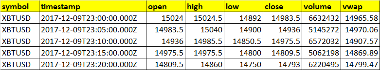
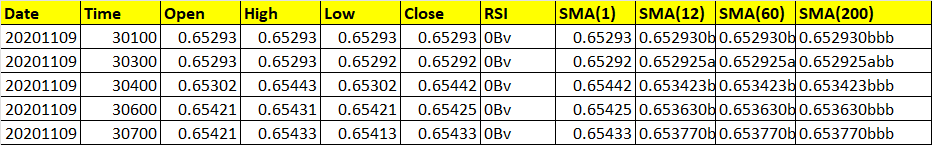
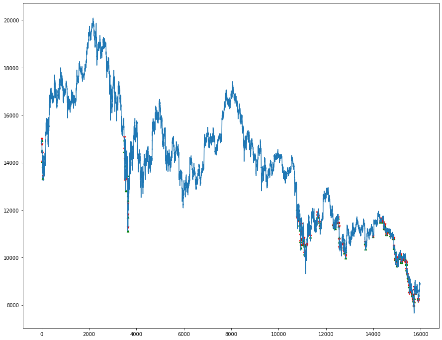

# Introduction
This repo is designed for beginners in the deep learning community -- especially those trying to implement reinforcement learning to predict stocks/crypto/forex (or basically any time-distributed data). However, the original repository seems to not receive any updates anymore; while the packages in its `requirements.txt` are getting obsolete.

In this manner, this repo is a humble attempt to revive the usability of the original author's work. Note that this repo is also designed and tested within a Google Colab environment so that anyone can just:

```
!git clone https://github.com/notpestilence/deep_rl_trader
``` 
And start plugging their own data. Good luck on your project ❤
# Deep RL Trader (Duel DQN) Implemented using Keras-RL

This repo, forked from [the original author](https://github.com/miroblog/deep_rl_trader), contains:
1. Trading environment (OpenAI Gym) for trading cryptocurrency  
2. Duel Deep Q Network  
Agent is implemented using `keras-rl`(https://github.com/keras-rl/keras-rl)     
  
For a complete list of rework, check the next segment: **Changes from `master`**.  
Agent is expected to learn useful action sequences to maximize profit in a given environment.  
Environment limits agent to either buy, sell, hold stock(coin) at each step.  
If an agent decides to take a   
* LONG position it will initiate sequence of action such as `buy - hold - hold- sell`    
* for a SHORT position vice versa (e.g.) `sell - hold - hold -buy`.    

Only a single position can be opened per trade. 
* Thus invalid action sequence like `buy - buy` will be considered `buy- hold`.   
* Default transaction fee is : 0.0005  

Reward is given
* When the position is closed, or
* An episode is finished.   
  
This type of sparse reward granting scheme takes longer to train but is most successful at learning long term dependencies.  

Agent decides optimal action by observing its environment.  
* Trading environment will emit features derived from ohlcv-candles(the window size can be configured). 
* Thus, input given to the agent is of the shape `(window_size, n_features)`.  

With some modification it can easily be applied to stocks, futures or foregin exchange as well.

***NOTE:*** The following 3 files have been changed its behaviour to facilitate running in a Google Colab environment. More on that within the next sub-segment.

[Visualization](https://github.com/notpestilence/deep_rl_trader/blob/master/main/visualize_trade.py) / [Main](https://github.com/notpestilence/deep_rl_trader/blob/master/main/ddqn_rl_trader.py) / [Environment](https://github.com/notpestilence/deep_rl_trader/blob/master/main/TraderEnv.py)

Sample data provided is 5min ohlcv candle fetched from bitmex.
* train : `'./data/train/` 70000
* test : `'./data/train/` 16000

Data shapes should follow the sample data used to ensure workability and potentially narrow down the problem to the processing part -- not the modelling part. For a preview of what the data should look like (or similar to), check the segment **Data Preview**.

### Changes from `master`
Assuming that this is being run on a Google Colab environment (as per 1 December 2021)...
Issues and changes to the original implementation:
1. A lot of inconsistencies in the `requirements.txt` file in which some modules cannot be imported. For instance, `anaconda_client==1.6.0` is not available anymore. Therefore, installing requirements via `pip install -r requirements.txt` is strongly advised against since it'll crash at the first occurrence of unfounded package within PyPI. Instead, call:
```
!cat deep_rl_trader/requirements.txt | xargs -n 1 pip install
```
This will skip errors and unsupported obsolete packages and continue to install. 

2. The package `talib` does not provide easy installation via `pip`. This will return:

```
Failed building wheel for TA-Lib #4245
```

So that we need to first download the `.tar.bz2` file in the environment -- and configure `numpy` to take at **least** version `1.20.00`. Otherwise, `talib` will return:
```
ValueError: numpy.ndarray size changed, may indicate binary incompatibility. Expected 88 from C header, got 80 from PyObject
```
This is yet another reason not to install directly from `requirements.txt` as some of the packages are either obsolete, deprecated of their functionality, or both 🥵
To quickly install `talib` within any Notebook environment:
```
url = 'https://anaconda.org/conda-forge/libta-lib/0.4.0/download/linux-64/libta-lib-0.4.0-h516909a_0.tar.bz2'
!curl -L $url | tar xj -C /usr/lib/x86_64-linux-gnu/ lib --strip-components=1
url = 'https://anaconda.org/conda-forge/ta-lib/0.4.19/download/linux-64/ta-lib-0.4.19-py37ha21ca33_2.tar.bz2'
!curl -L $url | tar xj -C /usr/local/lib/python3.7/dist-packages/ lib/python3.7/site-packages/talib --strip-components=3
import talib
```
This will GET the required TA-Lib from `conda-forge` and unpack the `.tar.bz2` to the existing working directory. Neat!🥰

3. Install `Keras`, not `keras`, with:

```
!pip install Keras==2.1.2
!pip install keras-rl==0.4.2
```

The version used in this model is way different than the one integrated with Google Colab. After installing, don't forget to modify the `core.py` file as stated within point no.8.

4. `pandas.stats` in the file `ta.py` was deprecated, so in return, we change all occurences of `moments` with `pd` and delete the line where we import `pandas.stats`. Functionality remains the same 🙌

5. `data/train` and `data/test` on `main()` was changed to read as a subfolder of `deep_rl_trader`. As well as the `info` and `model` subfolders.
6. Again, I think that the version used is obsolete and doesn't support old methods. Running the script provides:
```python
AttributeError: module 'tensorflow' has no attribute 'get_default_graph'
```
A bit of Googling and it turns out that we should import the model from `tensorflow` and not `keras`. We have to have a perfect environment for the whole thing to work -- that means downgrading the existing tensorflow integration:
```
%tensorflow_version 1.14.0
```
Or install the required version:
```
!pip install tensorflow==1.14.0
```
**NOTE:** For some reason, trying to install Tensorflow beyond 1.13 is unavailable within my machine. I'm rocking 2.5 now.

7. The original `create_model()` function does not return the `model` object -- so when initializing it, the script returns:
```
AttributeError: 'NoneType' object has no attribute 'summary'
```
One way to fix this was to return `model` at the end of the function. GG.

8. Updating the `core.py` file in:
```
/usr/local/lib/python3.7/dist-packages/rl/
```
To the one within:
```
/content/main/deep_rl_trader/modified_keras_rl_core/
```
Seems to fix [this](https://github.com/miroblog/deep_rl_trader/issues/2) issue.

9. Again, compatibility issue. Using `CuDNNLSTM` returns a vague error:
```
Errors may have originated from an input operation. Input Source operations connected to node cu_dnnlstm_1/CudnnRNN
```
This is maybe because TensorFlow automatically configures standard off-the-shelf LSTM to be CuDNNLSTM unless specified otherwise. So, the main functional layer(s) should be only `keras.layers.LSTM` instead of `keras.layers.CuDNNLSTM`.

10. Final changes made to take in `hdf5` format on the `TraderEnv.py` file within class method `OhlcvEnv.load_from_csv()` to maximize Vaex performance. Whilst the method still says `load_from_csv()`, the workings inside are loading `hdf5`. Why didn't I change the method name altogether? I'm afraid it'll mess with the `main()` method and some other method I don't know about.

11. Specified `nb_steps=10000` and `nb_max_episode_steps=10000` when fitting the model in `ddqn_rl_trader.py` to facilitate 10000 epochs.

12. Visualization now renders a figure of size `(12, 15)` and takes the most recent output of the weights inside the `info` folder. More versatility = less hard-coding the weight names. Check the function `get_file(dir)` on line 33 of `visualize_trade.py`

13. Integrated to run with `vaex` -- a novel out-of-core DataFrame for Python -- instead of the usual `pandas`. Read more about them [here](https://vaex.io/).

### What Vaex?

Vaex is not automatically included with Google Colab. However, when I first installed it by `!pip install vaex` and imported it, I got the error:
```python
ContextualVersionConflict: (PyYAML 3.13 (/usr/local/lib/python3.7/dist-packages)
Requirement.parse('PyYAML>=5.1; extra == "standard"'), {'uvicorn'}) 
```
Turns out Google Colab is running a rather old version of IPython, therefore an upgrade is needed:
```
!pip install --upgrade ipython
!pip install vaex
```
Restart the kernel after upgrading ipython. Now the error is gone. Huzzah! 🤩

Note that we're adding `%%timeit` preceding every cell to underline how **quick** vaex is.

### Data Preview

The data should take in the shape like this; what's important is the column name and the datatype of each column. Make sure to convert what's considered a date/time to datetime type.
**Sample data for model only:**


**Sample data for entire notebook:**


For symbol, it can take any transaction representation you want. USDTALICE, IDRUSD, etc.

### Prerequisites
To run the model only (without data processing):
```
numpy==1.20.00
tensorflow==1.14.0
Keras==2.1.2
keras-rl==0.4.2
libta-lib==0.4.0
ta-lib==0.4.19
```
To run the whole notebook in `vaex_ml_forex.ipynb`:
```
vaex==4.6.0
```

## Getting Started 
### How do I start?
1. Download the notebook `vaex_ml_forex.ipynb`;
2. Upload the notebook as a Google Colab runtime;
3. Upload your data of choice onto that kernel;
4. Run the first cell of the notebook to install `vaex` and upgrade `ipython` altogether;
5. Restart runtime;
6. Clone this repo:
```
!git clone https://github.com/notpestilence/deep_rl_trader/
```
This is on the 3rd cell.

7. Read your data onto the `vaex` environment with `vaex.from_csv()`

8. Export either to `.hdf5` or `.csv` on section 3.3.

9. Run the cell with the comment: "# Run this entire cell to import packages without setup". No need to restart the runtime again despite prompted.

10. **<font color="magenta">Important!</font>** Navigate through the file browser on the left. Change the `core.py` file within:
```
/usr/local/lib/python3.7/dist-packages/rl/
```
With the one in:
```
/content/main/deep_rl_trader/modified_keras_rl_core/
```
Just copy-and-paste the modified `core.py` to the original in `~./rl/` folder. I don't think there's a way to automatically do this -- we'll have to make do manually.

11. Run the cell with:
```python
import tensorflow.compat.v1 as tf
!python deep_rl_trader/main/ddqn_rl_trader.py
```

12. Wait a few seconds...

13. Profit 🥵

### Create Environment & Agent
```python
# create environment
# OPTIONS
ENV_NAME = 'OHLCV-v0'
TIME_STEP = 30
PATH_TRAIN = "./data/train/" # Change as needed
PATH_TEST = "./data/test/" # Change as needed
env = OhlcvEnv(TIME_STEP, path=PATH_TRAIN)
env_test = OhlcvEnv(TIME_STEP, path=PATH_TEST)

# random seed
np.random.seed(123)
env.seed(123)

# create_model
nb_actions = env.action_space.n
model = create_model(shape=env.shape, nb_actions=nb_actions)
print(model.summary())


# create memory
memory = SequentialMemory(limit=50000, window_length=TIME_STEP)

# create policy
policy = EpsGreedyQPolicy()# policy = BoltzmannQPolicy()

# create agent
# you can specify the dueling_type to one of {'avg','max','naive'}
dqn = DQNAgent(model=model, nb_actions=nb_actions, memory=memory, nb_steps_warmup=200,
               enable_dueling_network=True, dueling_type='avg', target_model_update=1e-2, policy=policy,
               processor=NormalizerProcessor())
dqn.compile(Adam(lr=1e-3), metrics=['mae'])
```

### Train and Validate
```python
# now train and test agent
while True:
    # train
    dqn.fit(env, nb_steps=10000, nb_max_episode_steps=10000, visualize=False, verbose=2)
    try:
        # validate
        info = dqn.test(env_test, nb_episodes=1, visualize=False)
        n_long, n_short, total_reward, portfolio = info['n_trades']['long'], info['n_trades']['short'], info[
            'total_reward'], int(info['portfolio'])
        np.array([info]).dump(
            './info/duel_dqn_{0}_weights_{1}LS_{2}_{3}_{4}.info'.format(ENV_NAME, portfolio, n_long, n_short,
                                                                        total_reward))
        dqn.save_weights(
            './model/duel_dqn_{0}_weights_{1}LS_{2}_{3}_{4}.h5f'.format(ENV_NAME, portfolio, n_long, n_short,
                                                                        total_reward),
            overwrite=True)
    except KeyboardInterrupt:
        continue

```

### Configuring Agent
```python
## simply plug in any keras model :)
def create_model(shape, nb_actions):
    model = Sequential()
    model.add(LSTM(64, input_shape=shape, return_sequences=True))
    model.add(LSTM(64))
    model.add(Dense(32))
    model.add(Activation('relu'))
    model.add(Dense(nb_actions, activation='linear'))
```

### Running 
[Verbose] While training or testing, 
* environment will print out (current_tick , # Long, # Short, Portfolio)
  
[Portfolio]  
* initial portfolio starts with 100 * 10000 (KRW - Korean won). This is roughly equivalent to 847.57 USD.     
* reflects change in portfolio value if the agent had invested 100% of its balance every time it opened a position.       
  
[Reward] 
* Simply pct earning per trade.    

### Inital Result

#### Trade History : Buy (green) Sell (red)
  

#### Cumulative Return, Max Drawdown Period (red)


In the initial trial, I ran for 2 episodes with 10000 epochs each. The results:

First episode:
* Runtime: **33.026 seconds**
* Entry: 1,000,000 KRW (838.69 USD)
* Exit: 2,642,730 KRW (2,223.37 USD)
* Percentage profit: 264.273% (2.64 fold)
* Net profit: 1,642,730 KRW (1,382.05 USD)

Second episode:
* Runtime: **28.662 seconds**
* Entry: 1,000,000 KRW (838.69 USD)
* Exit: 8,265,654.74 KRW (6,932.36 USD)
* Percentage profit: 826.56% (8.2656 fold)
* Net profit: 7,265,654.74 KRW (6,109.96 USD)

## Authors

* **Lee Hankyol** - *Initial work* - [deep_rl_trader](https://github.com/miroblog/deep_rl_trader)

## License

This project is licensed under the MIT License - see the [LICENSE.md](LICENSE.md) file for details
